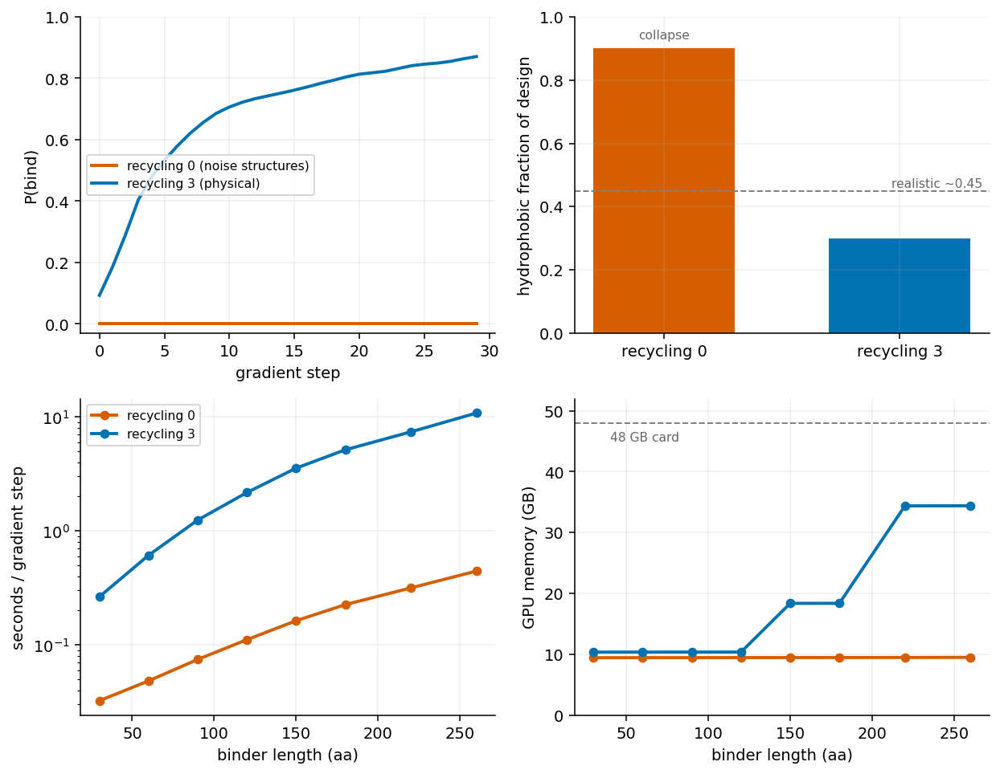

# nise-grad

[](https://github.com/ssiddhantsharma/nise-grad/actions/workflows/ci.yml)
[](LICENSE)

Design small-molecule-binding proteins by gradient descent: optimize the binder sequence
directly through a differentiable structure model (joltz / Boltz-2) and a differentiable
P(bind). Reimplements the idea of NISE (Polizzi lab,
https://www.nature.com/articles/s41586-026-10670-w) with gradients instead of a gradient-free
selection loop. Not a fork.

## The finding: recycling makes gradient design work
Naive gradient ascent on P(bind) is known to reward-hack: it collapses to a degenerate
hydrophobic string that maxes the affinity logit without binding. That collapse turned out to
be an artifact of the oracle's fast default, `recycling_steps=0`. At zero recycles the Boltz-2
structure is noise (~0 of 119 backbone bonds), so the affinity head is scoring garbage and any
sequence that games it wins.

Folding a physical structure each step (`recycling_steps=3`, 119/119 backbone bonds) fixes it,
with no regularizer: P(bind) climbs to ~0.85 and the design stays realistic (Trp/His/aromatic
rich, sensible for an aromatic ligand). The cost is ~10-25x slower and ~3.5x memory, both fine
to ~260 aa on a 48 GB card.



```python
optimize_pbind(oracle, feats, 30, steps=30, recycling_steps=3)   # physical, real designs
optimize_pbind(oracle, feats, 30, steps=30, recycling_steps=0)   # fast default, reward-hacks
```
`scripts/recycling_recipe.py` regenerates the figure from `scripts/data/`.

## Optional: ligand-aware regularizer
When you want an explicit sequence prior (e.g. for selectivity), `src/nisegrad/ligand_mpnn_reg.py`
scores the soft sequence with LigandMPNN
([jligandmpnn](https://github.com/ssiddhantsharma/jligandmpnn)), conditioned on the backbone
and ligand. It is a drop-in `mpnn=` term for `optimize_pbind`, differentiable in the sequence;
`src/nisegrad/boltz_ligand.py` builds it from a Boltz feature dict + output. On a frozen
scaffold the P(bind) gradient is ~28x the prior's, so it needs a large weight to matter; with
recycling in the loop it is usually unnecessary.

## Layout
- `src/nisegrad/oracle.py` differentiable `P(bind)(sequence, ligand)` (`recycling_steps` knob)
- `src/nisegrad/optimize.py` gradient ascent: P(bind), MPNN-regularized, or on-minus-off selectivity
- `src/nisegrad/ligand_mpnn_reg.py`, `boltz_ligand.py` the optional ligand-aware prior
- `scripts/` gradient check, optimization runs, and the figures

## Install
Built on joltz (with the affinity head) + mosaic. GPU:
```
pip install -e .
# GPU jax that works with mosaic/joltz on CUDA 12 (newer nvidia libs break cuSPARSE):
pip install "jax[cuda12]==0.10.1"
pip install nvidia-cudnn-cu12==9.17.0.29 nvidia-cusolver-cu12==11.7.3.90 \
            nvidia-nccl-cu12==2.28.9 nvidia-nvshmem-cu12==3.4.5
```
Checkpoints (in `~/.boltz`, or point `NISEGRAD_BOLTZ_CACHE` at a dir with `ccd.pkl` + `mols/`):
`boltz2_conf.ckpt` (structure), `boltz2_aff.ckpt` (affinity head).

## Running efficiently
- `recycling_steps`: 0 is fast but non-physical (reward-hacks); 3 gives real designs at ~10-25x
  the cost. The main quality knob.
- `num_sampling_steps` (`PbindOracle`): 2-8 give a usable gradient.
- Binder length drives O(N²) memory; `recycling_steps=3` fits to ~260 aa on a 48 GB card.
