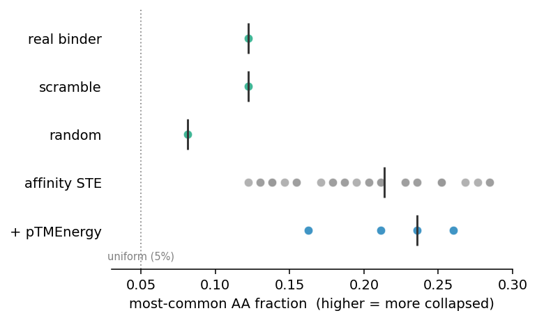
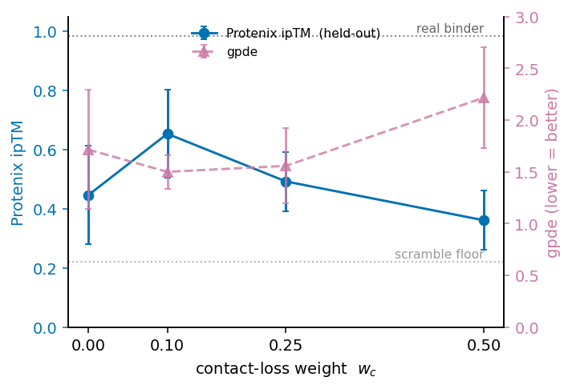

# nise-grad

[](https://github.com/ssiddhantsharma/nise-grad/actions/workflows/ci.yml)
[](LICENSE)

Gradient design of small-molecule-binding proteins. The binder sequence is optimized directly
through a differentiable Boltz-2 affinity oracle, and every design is screened on a second,
architecturally-related model (Protenix-2). Boltz-2 and Protenix-2 are both AF3-style co-folders
trained on largely the same PDB/BioLiP data, so the judge is a held-out model but not an
independent one: correlated failure modes are expected, and a plateau seen through it may be a
shared-bias ceiling rather than a fundamental one. A gradient counterpart to NISE (Polizzi lab,
https://www.nature.com/articles/s41586-026-10670-w), which does the same job by gradient-free
selection. Not a fork.

This is differentiable guidance: backprop the oracle gradient into the sequence (cf. DRaFT,
Clark et al. 2023). The rest of the guidance literature keeps the oracle black-box (FK-steering,
DPO, O3; Kalisz et al. 2026) because real biological oracles are non-differentiable. Ours is
differentiable only because the oracle is a model, which is why it is cheap and also why it
overfits.

**Status: active.** Optimizing the *soft* sequence maximizes a fiction: the naive soft optimum
sits between amino acids and its argmax refolds to degenerate poly-X at P(bind) ~0.9. A
straight-through estimator closes that soft-to-discrete gap, so STE optimizes the real discrete
design's P(bind); the STE designs have realistic (if composition-biased) sequences, not poly-X. But
STE still overfits Boltz, so the optimized oracle cannot be trusted on its own; filter on Protenix-2,
anchored by real crystal binders (apixaban apx1049 0.97 / gpde 0.34, cortisol hcy129 0.86 / gpde
0.62) vs scramble/random at 0.24 to 0.51 / gpde 1.9 to 2.7. De-novo gradient plateaus below the real
binder and no objective lever (eight tried, including a decoupled-STE temperature sweep) or second
target breaks that band. The bottleneck is the pocket, not the sequence: freezing a real backbone
and designing a fresh sequence to fit it reaches held-out 0.83, nearly double de-novo (0.45) and
near the real binder (0.97). This mirrors DBMol (Qin et al. 2026) on the molecule side. Direction:
gradient design as a differentiable refinement layer over a designed backbone; wet lab is the real
bar.

## Method
A binder sequence over the 20-residue simplex is optimized by gradient ascent through a
differentiable Boltz-2 oracle, then screened on a second, architecturally-related model
(Protenix-2; held-out weights, not an independent oracle).

**Objective.** For a soft sequence `m` folded with the fixed ligand, minimize

```
L(m) = -P_bind(m)  +  w_c · L_contact(m)  +  w_pae · L_conf(m)              (1)

  P_bind     Boltz-2 affinity binder/non-binder logit                  maximize    (2)
  L_contact  mosaic BinderTargetContact on the Boltz distogram:
             -log P(binder residue to ligand atom < 8 A), top-3/residue  interface (3)
  L_conf     mean binder/ligand interface PAE                            confident (4)
```

**Algorithm** (straight-through gradient design)

```
Input:  ligand, binder length N, budget K, weights (w_c, w_pae), optional scaffold s
Init:   x <- bias·one_hot(s) + noise   if scaffold   else   noise         # logits [N,20]
for k = 1 .. K:
    soft <- softmax(x)
    hard <- one_hot(argmax(soft))
    seq  <- soft + stop_grad(hard - soft)              # forward=hard, backward=soft
    pbind, out <- Boltz2(seq, ligand; recycling=3)     # fold the discrete design
    L    <- -pbind + w_c·contact(out) + w_pae·conf(out)          # eq. (1)
    x    <- Adam(x, dL/dx)
return argmax(x)                                       # a discrete binder sequence
```

**Pipeline**

```
init (random | pocket scaffold) -> STE-optimize L -> [project: LigandMPNN] -> Protenix-2 filter
```

`scripts/matched_budget.py` runs the optimizer (STE / Best-K-of-N / O3; `--contact-weight`,
`--confidence-weight`, `--init-seq`). `scripts/protenix_score.py` is the held-out filter.

## The straight-through estimator
The argmax that turns a soft distribution into a real sequence is not differentiable, so you
cannot backprop through "pick the top amino acid". Optimizing the soft sequence instead maximizes
a fiction: its optimum sits between real amino acids, so the soft P(bind) climbs to ~0.8 but the
discrete argmax, refolded, scores 0.1 to 0.3 and is degenerate (poly-Leu / poly-Phe). STE fixes
this by scoring the discrete sequence in the forward pass while letting the gradient flow through
the soft distribution:

```python
hard = one_hot(argmax(soft))
seq  = soft + stop_gradient(hard - soft)   # forward = hard, backward = soft
```

The value being maximized is now the discrete design's P(bind), while the logits still get a
gradient.


*30aa binder, recycling=3, num_sampling_steps=25, 3 seeds each. Naive soft P(bind) reaches ~0.9
but the discrete design scores 0.33 to 0.41 and is degenerate. STE optimizes the discrete design
directly: 0.44 to 0.73 with realistic composition, well-folded (119/119 backbone bonds, pLDDT
~0.8).* `scripts/optimize_ste.py`.

## The held-out judge, and the ceiling
STE closes the soft-to-discrete gap within Boltz, but it does not by itself make real binders. A
model optimized against its own head overfits by construction, so trusting the optimized oracle
is a mistake. Refold every design on a second model, Protenix-2, and keep only what survives (its
weights are held out from the optimization, though it shares Boltz's architecture family and
training data, so treat surviving as necessary, not sufficient). The metric matters: generic ipTM
is too compressed to filter on (random sequences score ~0.7), while Protenix `gpde` and
`ranking_score` separate real crystal binders from nonsense. Two provenance-documented de-novo
binders anchor the judge (Lee, Pellock, Norn et al., Nat Commun 2026): apixaban apx1049 (PDB 8VEZ)
scores 0.97 / gpde 0.34 and cortisol hcy129 (PDB 8UQF) 0.86 / gpde 0.62, while scramble and random
sit at 0.24 to 0.51 / gpde 1.9 to 2.7. As the optimization budget rises (25/100/250, n=20 each) the
Boltz proxy climbs but the held-out ipTM does not follow it up (0.47 -> 0.43 -> 0.36) even as gpde
improves (1.60 -> 1.19): more optimization buys a more confidently folded structure, not a better
binder. The same picture DBMol found on the molecule side.


No objective lever moves the design to the real-binder bar. Eight terms added to plain STE
(confidence, contact, scaffold-init, pTMEnergy, decoupled-STE, KL-to-natural composition,
anti-homopolymer repetition) all keep the mean at 0.36 to 0.55, far below the real binder (0.97);
at n=3 to 20 the between-lever differences sit within their spread. The decoupled straight-through
estimator (arXiv 2410.13331) was swept across backward temperatures 0.25/0.5/0.75/2.0 and stays
flat at 0.36 to 0.42, so the plateau is not a gradient-estimator artifact. It also holds on a
second, chemically distinct target: cortisol STE designs reach 0.37 against the real cortisol
binder at 0.86.


The decoupled-STE sweep is flat across temperatures, and the plateau is not apixaban-specific
(cortisol STE designs vs the real cortisol binder):


Two per-lever details: pTMEnergy improves the structure (gpde) but not the binding ceiling, and the
sequence collapse the composition/repetition terms target is real and measurable; the distogram
contact loss lifts the mean but does not break the band:






The projection experiment shows the mechanism, and points to the fix. Projecting a design onto its
own reward-hacked structure (LigandMPNN `score_soft`, `scripts/project.py`) makes the held-out score
worse (0.51 -> 0.39): the structure is the problem, so fitting a sequence to it cannot help. But
freezing a real pocket backbone and designing a fresh random-init sequence to fit it flips the
result. On the apx1049 crystal backbone (`scripts/rescue_backbone.py`) the designed sequences reach
held-out ipTM 0.83 (n=8, up to 0.91), gpde 0.66, with realistic composition, near the real binder
(0.97) and nearly double de-novo STE (0.45). Same sequence machinery; the only added ingredient is
a real backbone.


The reading: sequence-only gradient design plateaus because it optimizes the sequence but never
builds the pocket. The rescue demonstrates this directly, and confirms the division of labour:
nise-grad is a working differentiable refinement and scoring layer, but the pocket has to come from
backbone design (as the field's small-molecule binders do). The natural next step is a forward-pass
structure-update loop (cf. HalluDesign) that moves the backbone with Boltz's diffusion module and
redesigns with jligandmpnn.

## Limitations
The plateau is well-supported; the rest is honest scope. Specifically:
- **Two targets.** Held-out results cover apixaban and cortisol. The plateau holds on both, but
  broader generality needs more diverse ligands.
- **Related, not independent, judge.** Boltz-2 and Protenix-2 share architecture family and
  training data; a design that exploits a shared bias can pass both. The rescue's high score is
  reassuring (a real binder folds well on both), but the judge is not a truly independent oracle.
- **The rescue uses a real binder's backbone.** It proves the sequence layer works *given* a good
  pocket (apx1049's), which localizes the bottleneck; it is not yet de-novo binder generation
  (that needs a backbone generator, the HalluDesign-style next step).
- **Budget is steps, not FLOPs.** An STE step is a forward + backward (~3x a fold); Best-K-of-N and
  O3 spend one forward fold per unit budget, so equal "budget" is not equal compute.
- **In silico only.** No wet-lab validation; all claims are model-internal.

## Layout
- `src/nisegrad/oracle.py` differentiable `P(bind)(sequence, ligand)`, the in-loop optimizer
- `src/nisegrad/optimize.py` STE gradient ascent (optional interface-PAE confidence term)
- `scripts/matched_budget.py` generate designs (STE / Best-K-of-N / O3) at a fold budget
- `scripts/protenix_score.py` held-out Protenix-2 judge (iptm, ligand ipTM, gpde, ranking)
- `scripts/project.py` late-projection onto a frozen structure (LigandMPNN `score_soft`,
  via `src/nisegrad/boltz_ligand.py` + `ligand_mpnn_reg.py`)
- `scripts/rescue_backbone.py` design a fresh sequence on a real (frozen) pocket backbone
- `scripts/fold_driver.sh` phase-flagged runner (anchors / cortisol / budget / levers / dstesweep / rescue)
- `scripts/data/anchors.json` verified crystal-binder anchors (apx1049, hcy129) with ligand SMILES
- `scripts/*_figure.py` the figures; `scripts/data/` the scored experiment logs
- `scripts/optimize_ste.py` a single STE run

## References and credit
nise-grad borrows from and builds on:
- NISE (Polizzi lab), the gradient-free selection loop this is a gradient counterpart to.
  https://www.nature.com/articles/s41586-026-10670-w
- DRaFT (Clark et al. 2023), reward backprop through a differentiable generative model.
- O3 / oracle budgets (Kalisz et al. 2026), the black-box guidance literature we position against.
- DBMol (Qin et al. 2026), the molecule-side mirror; corroborates the plateau and reward-hacking
  and supplies the contact-loss idea. https://arxiv.org/abs/2607.19237
- BindEnergyCraft (Nori et al. 2025), pTMEnergy, the energy objective that resists reward-hacking
  (`--ptm-energy`). https://arxiv.org/abs/2505.21241
- L-Caliby / Caliby (Shuai et al.), the pocket-then-scaffold decomposition (`--pocket-scaffold`).
  https://github.com/ProteinDesignLab/caliby

Tools: Boltz-2 (via joltz), Protenix-2, mosaic (`BinderTargetContact` and losses), and LigandMPNN
(Dauparas et al.) via [jligandmpnn](https://github.com/ssiddhantsharma/jligandmpnn).

## Install
```
pip install -e .
# GPU jax that works with mosaic/joltz on CUDA 12 (newer nvidia libs break cuSPARSE):
pip install "jax[cuda12]==0.10.1"
pip install nvidia-cudnn-cu12==9.17.0.29 nvidia-cusolver-cu12==11.7.3.90 \
            nvidia-nccl-cu12==2.28.9 nvidia-nvshmem-cu12==3.4.5
```
Checkpoints in `~/.boltz` (or set `NISEGRAD_BOLTZ_CACHE`): `boltz2_conf.ckpt`, `boltz2_aff.ckpt`.
Independent designs are embarrassingly parallel, one per GPU, for campaign throughput.
