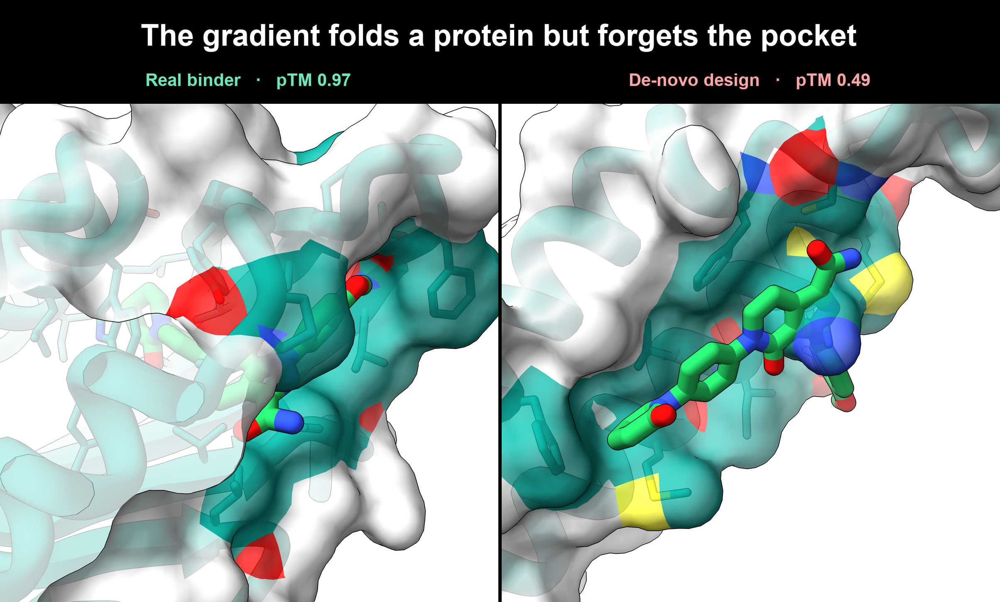

# nise-grad

[](https://github.com/ssiddhantsharma/nise-grad/actions/workflows/ci.yml)
[](LICENSE)

Does making the affinity oracle differentiable help design small-molecule binders? A controlled study.
Gradient ascent through a differentiable Boltz-2 oracle reward-hacks and plateaus far below real crystal
binders, and the bottleneck is the pocket backbone, not the sequence. The differentiable counterpart to
NISE (Polizzi lab), which does the same job by gradient-free selection.



- **It plateaus.** Across 14 ligands the best de novo design reaches held-out interface pTM 0.66 against
  0.93 for the real binders, and it beats gradient-free search (0.51 / 0.48) yet stalls at the same
  ceiling: the optimiser is not the limit.
- **The pocket is the limit.** Give the sequence layer a backbone, real or RFdiffusion3-generated, and it
  reaches 0.83 on a real backbone and 0.89 on RFdiffusion3 backbones across the panel, near the real
  binders. The gradient alone cannot build a foldable pocket and collapses to poly-alanine.
- **Reusable tooling.** A differentiable Boltz-2 affinity head (contributed to joltz) and a
  parity-checked JAX LigandMPNN port ([jligandmpnn](https://github.com/ssiddhantsharma/jligandmpnn)).

The method, the controlled study, and a de novo protein-small-molecule affinity benchmark are written up
in the workshop paper (under review). This repo holds the code and the scored data behind every number.

## Install
The repo ships a `uv.lock`, so `uv` is the reliable path. It resolves the `git+https` deps
(`joltz`, `mosaic`, `jligandmpnn`) that plain pip struggles with:
```
uv sync                       # build .venv from the lockfile
# GPU JAX for mosaic/joltz on CUDA 12, into the same venv:
uv pip install "jax[cuda12]==0.10.1" nvidia-cudnn-cu12==9.17.0.29 \
   nvidia-cusolver-cu12==11.7.3.90 nvidia-nccl-cu12==2.28.9 nvidia-nvshmem-cu12==3.4.5
```
Plain `pip install -e .` also works, but has to resolve `mosaic` from git; if that fights you, use `uv`.

## Weights
Neither set of weights is stored in this repo. Both are standard third-party model files.

**Boltz-2** (needed for every fold). All into `~/.boltz` (or `NISEGRAD_BOLTZ_CACHE`): the two model
checkpoints `boltz2_conf.ckpt` and `boltz2_aff.ckpt`, plus the CCD chemistry data `mols.tar` (untar into
`~/.boltz/mols/`) and `ccd.pkl`. The `boltz` CLI fetches all four automatically on its first run. If you
place them by hand, note that `ccd.pkl` is hosted in the boltz-**1** HF repo by design (Boltz-2 still reads
it, so this is not Boltz-1), the checkpoints and `mols.tar` are in the boltz-2 repo, and `mols.tar` must be
extracted into a `mols/` directory.

**LigandMPNN** (needed *only* for `rescue_backbone.py`, `project.py`, `guided_design.py` — not for the
core STE panel or baselines, which need only Boltz-2). Run `bash scripts/get_weights.sh`, which fetches
both files into `weights/` and prints the two env vars to export. Both come from the official LigandMPNN
repo (`github.com/dauparas/LigandMPNN`) and are not on GitHub as files. To do it by hand:
- `ligandmpnn_v_32_010_25.pt` from `files.ipd.uw.edu/pub/ligandmpnn/` (LigandMPNN's `get_model_params.sh`).
  Set `LIGANDMPNN_CKPT` to its path.
- its reference model module `model_utils.py` (which defines `ProteinMPNN`), placed in a directory so it
  imports as `ligmpnn_model`. Set `LIGMPNN_MODEL_DIR` to that directory.

## Layout
- `src/nisegrad/` differentiable `P(bind)(sequence, ligand)` oracle and the STE optimiser
- `scripts/matched_budget.py` STE / Best-K-of-N / O3 designs at a fold budget
- `scripts/panel_baseline.py` gradient-free baseline over the ligand panel
- `scripts/rescue_backbone.py` design a fresh sequence on a frozen real pocket backbone
- `scripts/run2_rfd3_arm.sh` RFdiffusion3 backbone → LigandMPNN → Protenix
- `scripts/protenix_score.py` held-out Protenix judge
- `scripts/data/` the scored experiment logs behind every number

## Credit
Builds on NISE (Polizzi lab), DBMol (Qin et al. 2026), BindEnergyCraft (Nori
et al. 2025), LambdaZero (Korablyov et al. 2024), LigandMPNN (Dauparas et al.), and RoseTTAFold All-Atom
(Krishna et al. 2024). Tools: Boltz-2 via [joltz](https://github.com/nboyd/joltz), Protenix, mosaic, and
[jligandmpnn](https://github.com/ssiddhantsharma/jligandmpnn).
