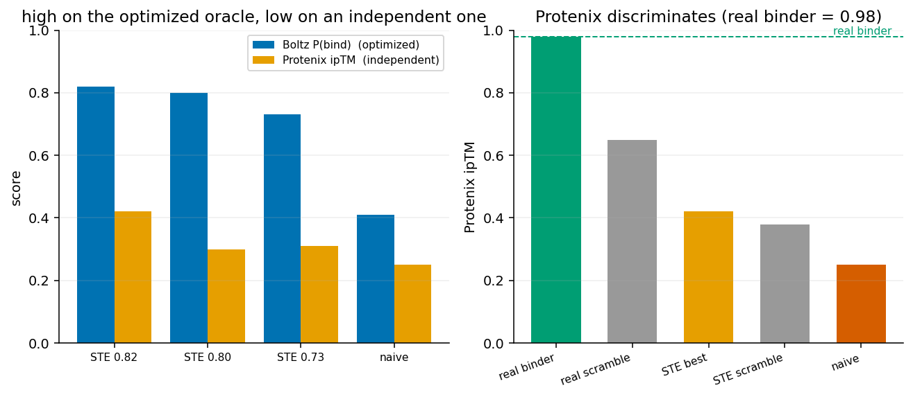

# nise-grad

[](https://github.com/ssiddhantsharma/nise-grad/actions/workflows/ci.yml)
[](LICENSE)

Design small-molecule-binding proteins by gradient descent: optimize the binder sequence
directly through a differentiable structure model (Boltz-2 via joltz) and a differentiable
P(bind). A gradient counterpart to NISE (Polizzi lab,
https://www.nature.com/articles/s41586-026-10670-w), which does the same job with a
gradient-free selection loop. Not a fork. This is *differentiable* guidance (backprop the oracle
gradient into the sequence, cf. DRaFT, Clark et al. 2023); the surrounding guidance literature
keeps the oracle black-box -- FK-steering, DPO, O3 (Kalisz et al. 2026) -- because real
biological oracles are non-differentiable. Ours is differentiable only because the oracle is a
*model*, which is both why it is cheap and why it overfits.

**Status: active.** A straight-through estimator fixes gradient design's soft-to-discrete gap,
but the designs overfit whichever oracle they were optimized against, and a second *head* of the
same model does not help. Two *independent* oracles (Protenix-v2 and jopendde) both score the
designs far below a real binder while agreeing a real binder is 0.98 -- independent enough to
optimize jointly. The current direction is a multi-oracle (Boltz+jopendde) objective, held out
on Protenix; wet-lab validation is the ultimate bar. Reusable now: the STE optimizer and
[jligandmpnn](https://github.com/ssiddhantsharma/jligandmpnn).

## The problem: naive gradient reward-hacks
Optimizing the *soft* (continuous) sequence maximizes a fiction. Its optimum sits between real
amino acids, so the soft P(bind) climbs to ~0.8, but the discrete argmax sequence, refolded,
scores only 0.1-0.3, and the design is degenerate (poly-Leu / poly-Phe).

## The fix: a straight-through estimator (STE)
The argmax that turns the soft distribution into a real sequence is not differentiable, so you
cannot backprop through "pick the top amino acid." STE sidesteps this: **score the discrete
sequence in the forward pass, but let the gradient flow through the soft distribution.** Each
step, take the one-hot `argmax(softmax(logits))` and fold *that* (so the objective is the real
discrete P(bind)); in the backward pass, treat the one-hot as if it were the softmax:

```python
hard = one_hot(argmax(soft))
seq  = soft + stop_gradient(hard - soft)   # forward = hard, backward = soft
```

Now the value being maximized is the discrete design's P(bind), not a soft illusion, while the
logits still get a gradient. Enable it with `optimize_pbind(..., straight_through=True)`.


*30aa binder, recycling=3, `num_sampling_steps=25`, 3 seeds each. Naive's soft P(bind) reaches
~0.9, but the discrete design scores 0.33-0.41 and is degenerate. STE optimizes the discrete
design directly: 0.44-0.73 with realistic composition, well-folded (119/119 backbone bonds,
pLDDT ~0.8).*

This keeps NISE's principle -- only ever score real discrete sequences -- in ~25 gradient steps
instead of NISE's thousands of folds; best-of-8 seeds on benzoic acid reaches P(bind) 0.82.
Caveats: P(bind) is the Boltz-2 oracle, not an experiment; harder ligands are more variable
(sulfonamide 0.44-0.66 vs benzoic acid 0.62-0.73); `nss>=25` is ~25x slower than `nss=2`.
Runnable: `scripts/optimize_ste.py`.

## The designs overfit the oracle; two independent oracles agree
STE closes the soft-to-discrete gap *within Boltz* -- it does not make real binders. Refolding
the designs with two independent models (Protenix-v2 and jopendde) tells the truth:



*The designs score high on the optimized oracle (Boltz) but far below a real binder on both
independent oracles; a real experimentally-validated binder (NISE's apixaban binder) scores 0.98
on both, so they discriminate and the low scores are real failures.* `scripts/oracle_overfit.py`.

Optimizing a single oracle games it. A second *head* of the same model
(`optimize_pbind(confidence_weight>0)`) does **not** help -- the design games both heads. But
Boltz and jopendde *disagree* on the hacked designs while *agreeing* on a real binder, so they
are independent enough to optimize jointly. **Current direction:** a multi-oracle
(Boltz+jopendde) STE objective, with Protenix held out as the transfer judge. A model optimized
against its own head overfits by construction, so the honest test is a *matched oracle budget*
scored on a held-out oracle: at equal folds, does gradient guidance beat Best-K-of-N sampling on
an oracle it never saw? (`scripts/matched_budget.py`, `scripts/heldout_score.py`).

## Layout
- `src/nisegrad/oracle.py` differentiable `P(bind)(sequence, ligand)`
- `src/nisegrad/optimize.py` STE gradient ascent (optional interface-PAE + ligand-aware MPNN terms)
- `src/nisegrad/ligand_mpnn_reg.py`, `boltz_ligand.py` ligand-aware LigandMPNN
  ([jligandmpnn](https://github.com/ssiddhantsharma/jligandmpnn)) regularizer, tested as the
  counter to affinity-head reward-hacking (does it raise the held-out score, not just lower Boltz?)
- `scripts/` STE run, matched-budget sweep, figures

## Install
```
pip install -e .
# GPU jax that works with mosaic/joltz on CUDA 12 (newer nvidia libs break cuSPARSE):
pip install "jax[cuda12]==0.10.1"
pip install nvidia-cudnn-cu12==9.17.0.29 nvidia-cusolver-cu12==11.7.3.90 \
            nvidia-nccl-cu12==2.28.9 nvidia-nvshmem-cu12==3.4.5
```
Checkpoints in `~/.boltz` (or set `NISEGRAD_BOLTZ_CACHE`): `boltz2_conf.ckpt`, `boltz2_aff.ckpt`.
Independent designs are embarrassingly parallel (one per GPU) for campaign throughput.
