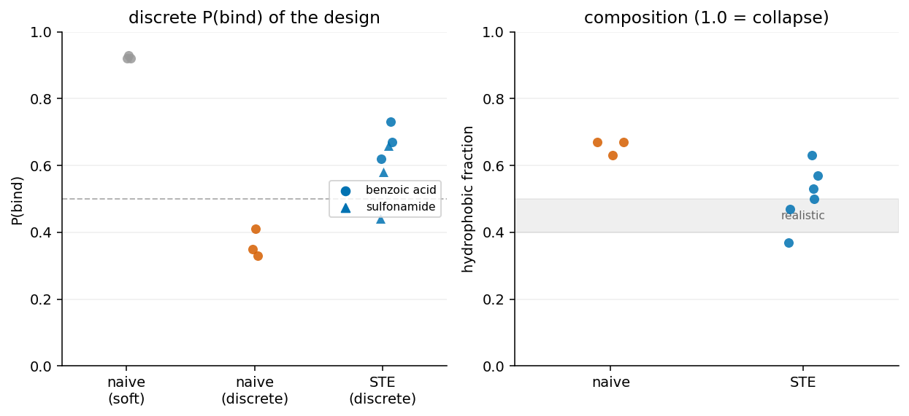
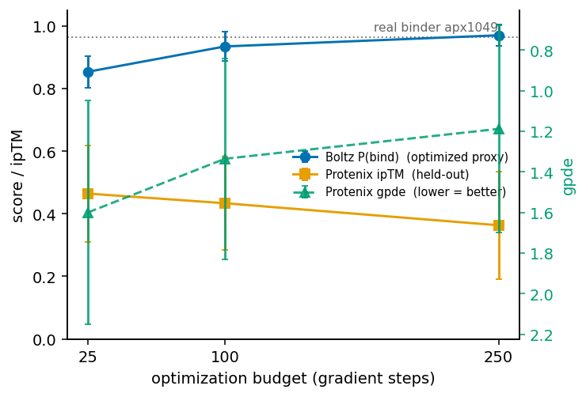
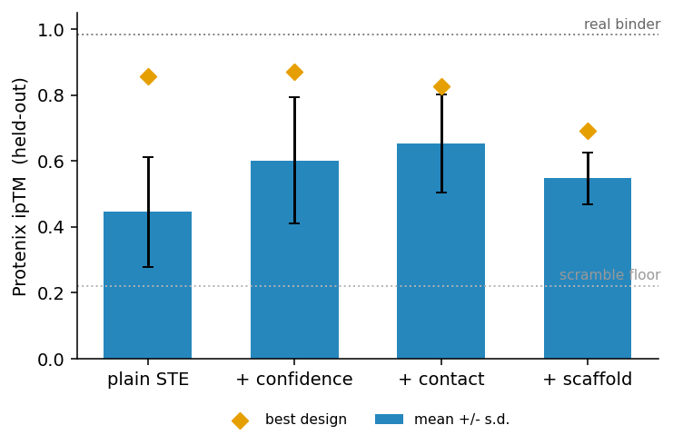
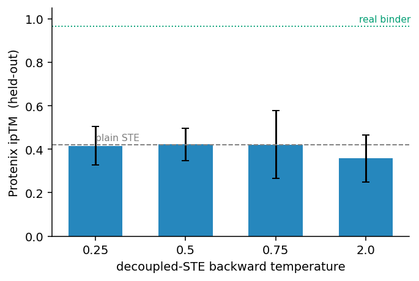
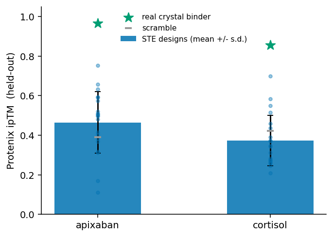
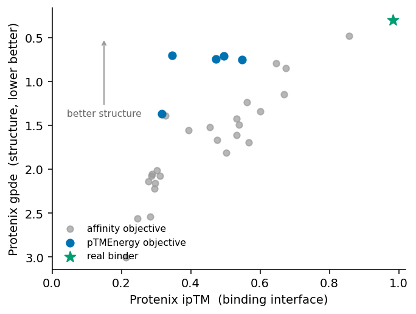
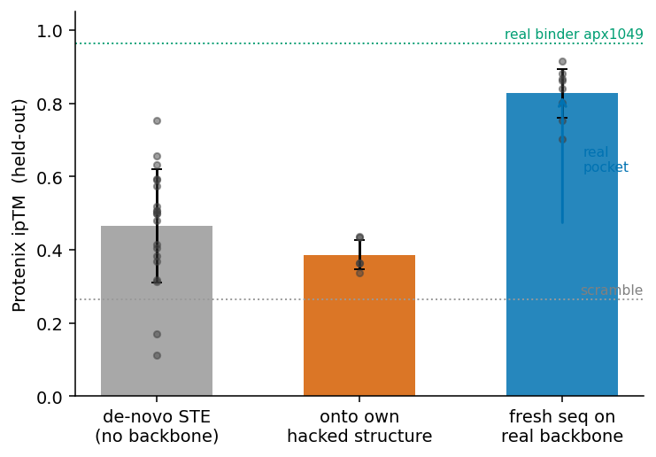
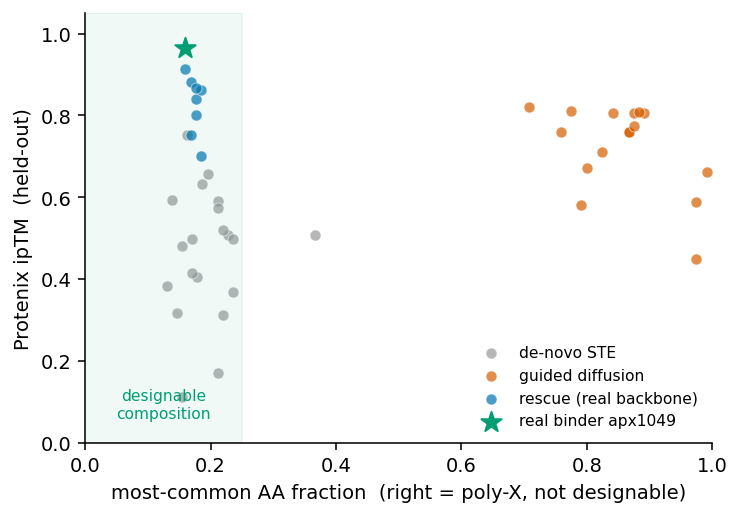

# nise-grad

[](https://github.com/ssiddhantsharma/nise-grad/actions/workflows/ci.yml)
[](LICENSE)

**Does making the oracle differentiable help design small-molecule binders?** A controlled study.
Gradient hallucination through a differentiable Boltz-2 oracle reward-hacks and plateaus far below
real crystal binders, and the bottleneck is the pocket backbone, not the sequence. The
differentiable counterpart to NISE (Polizzi lab), which does the same job by gradient-free selection.

nise-grad optimizes a binder sequence by gradient ascent through a differentiable Boltz-2 affinity
oracle (a straight-through estimator makes the objective the real discrete design, not a soft
illusion) and screens every design on Protenix-2. Three findings:

1. **It plateaus.** De-novo gradient tops out far below real binders, and nothing breaks the band:
   eight objectives (including a decoupled-STE temperature sweep), two chemically distinct targets
   (apixaban, cortisol), and rising budget all stay put. More optimization buys a better-folded
   structure (gpde), not a better binder (ipTM).
2. **The bottleneck is the pocket, not the sequence.** Give the same machinery a real pocket backbone
   and it reaches held-out 0.83 (vs de-novo 0.45, real binder 0.97); fit onto the design's own
   reward-hacked structure instead and it drops to 0.39. Structure quality decides the outcome.
3. **Reusable tools.** A differentiable Boltz-2 affinity head (merged into joltz) and a
   parity-verified JAX LigandMPNN port (jligandmpnn).

**Honest scope.** Protenix-2 is a second AF3-style model on largely the same data, so it is held-out
but not orthogonal. It is anchored on real crystal binders (which score high, scramble and random
low), so it discriminates real binding, but this is in-silico characterization, not wet-lab
validation.

This is differentiable guidance: backprop the oracle gradient into the sequence (cf. DRaFT, Clark et
al. 2023). The rest of the guidance literature keeps the oracle black-box (FK-steering, DPO, O3;
Kalisz et al. 2026), or amortizes an expensive non-differentiable oracle with active-learning search
(LambdaZero, Korablyov et al. 2024, on the molecule side), because real biological oracles are
non-differentiable; ours is differentiable only because the oracle is a model, which is why it is
cheap and also why it overfits.

## Method
A binder sequence over the 20-residue simplex is optimized by gradient ascent through a
differentiable Boltz-2 oracle, then screened on a second, architecturally-related model
(Protenix-2; held-out weights, not an independent oracle).

**Objective.** For a soft sequence `m` folded with the fixed ligand, minimize

```
L(m) = -P_bind(m)  +  w_c · L_contact(m)  +  w_pae · L_conf(m)              (1)

  P_bind     Boltz-2 affinity binder/non-binder logit                  maximize    (2)
  L_contact  mosaic BinderTargetContact on the Boltz distogram:
             -log P(binder residue to ligand atom < 8 A), top-3/residue  interface (3)
  L_conf     mean binder/ligand interface PAE                            confident (4)
```

**Algorithm** (straight-through gradient design)

```
Input:  ligand, binder length N, budget K, weights (w_c, w_pae), optional scaffold s
Init:   x <- bias·one_hot(s) + noise   if scaffold   else   noise         # logits [N,20]
for k = 1 .. K:
    soft <- softmax(x)
    hard <- one_hot(argmax(soft))
    seq  <- soft + stop_grad(hard - soft)              # forward=hard, backward=soft
    pbind, out <- Boltz2(seq, ligand; recycling=3)     # fold the discrete design
    L    <- -pbind + w_c·contact(out) + w_pae·conf(out)          # eq. (1)
    x    <- Adam(x, dL/dx)
return argmax(x)                                       # a discrete binder sequence
```

**Pipeline**

```
init (random | pocket scaffold) -> STE-optimize L -> [project: LigandMPNN] -> Protenix-2 filter
```

`scripts/matched_budget.py` runs the optimizer (STE / Best-K-of-N / O3; `--contact-weight`,
`--confidence-weight`, `--init-seq`). `scripts/protenix_score.py` is the held-out filter.

## The straight-through estimator
The argmax that turns a soft distribution into a real sequence is not differentiable, so you
cannot backprop through "pick the top amino acid". Optimizing the soft sequence instead maximizes
a fiction: its optimum sits between real amino acids, so the soft P(bind) climbs to ~0.8 but the
discrete argmax, refolded, scores 0.1 to 0.3 and is degenerate (poly-Leu / poly-Phe). STE fixes
this by scoring the discrete sequence in the forward pass while letting the gradient flow through
the soft distribution:

```python
hard = one_hot(argmax(soft))
seq  = soft + stop_gradient(hard - soft)   # forward = hard, backward = soft
```

The value being maximized is now the discrete design's P(bind), while the logits still get a
gradient (Figure 1).



*Figure 1. STE optimizes the real discrete design, not a soft illusion. 30aa binder, recycling=3,
num_sampling_steps=25, 3 seeds. Naive soft P(bind) reaches ~0.9 but its discrete argmax refolds to
0.33 to 0.41 and is degenerate; STE reaches 0.44 to 0.73 with realistic composition, well-folded
(119/119 backbone bonds, pLDDT ~0.8). `scripts/optimize_ste.py`.*

## The held-out judge, and the ceiling
STE closes the soft-to-discrete gap within Boltz, but it does not by itself make real binders. A
model optimized against its own head overfits by construction, so trusting the optimized oracle
is a mistake. Refold every design on a second model, Protenix-2, and keep only what survives (its
weights are held out from the optimization, though it shares Boltz's architecture family and
training data, so treat surviving as necessary, not sufficient). The metric matters: generic ipTM
is too compressed to filter on (random sequences score ~0.7), while Protenix `gpde` and
`ranking_score` separate real crystal binders from nonsense. Two provenance-documented de-novo
binders anchor the judge (Lee, Pellock, Norn et al., Nat Commun 2026): apixaban apx1049 (PDB 8VEZ)
scores 0.97 / gpde 0.34 and cortisol hcy129 (PDB 8UQF) 0.86 / gpde 0.62, while scramble and random
sit at 0.24 to 0.51 / gpde 1.9 to 2.7. As the optimization budget rises (25/100/250, n=20 each) the
Boltz proxy climbs but the held-out ipTM does not follow it up (0.47 -> 0.43 -> 0.36) even as gpde
improves (1.60 -> 1.19): more optimization buys a more confidently folded structure, not a better
binder (Figure 2). The same picture DBMol found on the molecule side.



*Figure 2. More optimization improves structure, not held-out binding. Plain STE on apixaban at
budgets 25/100/250 (n=20 each): the Boltz proxy climbs while held-out ipTM does not, even as gpde
falls. Data: budget_scored.json.*

No objective lever moves the design to the real-binder bar (Figure 3). Eight terms added to plain
STE (confidence, contact, scaffold-init, pTMEnergy, decoupled-STE, KL-to-natural composition,
anti-homopolymer repetition) all keep the mean at 0.36 to 0.55, far below the real binder (0.97); at
n=3 to 20 the between-lever differences sit within their spread.



*Figure 3. No objective lever breaks the ceiling. Held-out ipTM per objective added to plain STE
(eight levers); every one stays below the real binder (0.97), differences within noise at n=3 to 20.*

The plateau is not a gradient-estimator artifact and not apixaban-specific. The decoupled-STE
estimator, swept across backward temperatures, stays flat (Figure 4), and a second chemically
distinct target, cortisol, plateaus the same way against its real binder (Figure 5).



*Figure 4. The decoupled straight-through estimator (arXiv 2410.13331) does not help at any backward
temperature (0.25/0.5/0.75/2.0), all near plain STE and far below the real binder. Data:
dste_*_scored.json.*



*Figure 5. The plateau generalizes: cortisol STE designs (0.37) sit far below the real cortisol
binder (0.86), as on apixaban. Data: cortisol_scored.json, cort_anchors_scored.json.*

pTMEnergy is the one lever that improves the structure (gpde) without moving the binding ceiling,
the clearest single-objective view of the structure-versus-binding split (Figure 6).



*Figure 6. pTMEnergy pulls gpde toward the real binder but leaves ipTM on the plateau: the affinity
and pTMEnergy designs vs the real binder in (ipTM, gpde) space.*

The projection experiment shows the mechanism, and points to the fix. Projecting a design onto its
own reward-hacked structure (LigandMPNN `score_soft`, `scripts/project.py`) makes the held-out score
worse (0.51 -> 0.39): the structure is the problem, so fitting a sequence to it cannot help. But
freezing a real pocket backbone and designing a fresh random-init sequence to fit it flips the
result. On the apx1049 crystal backbone (`scripts/rescue_backbone.py`) the designed sequences reach
held-out ipTM 0.83 (n=8, up to 0.91), gpde 0.66, with realistic composition, near the real binder
(0.97) and nearly double de-novo STE (0.45). Same sequence machinery; the only added ingredient is
a real backbone (Figure 7).



*Figure 7. Structure quality is the bottleneck. Same sequence machinery, three targets: de-novo (no
backbone, 0.45), fitting onto the design's own reward-hacked structure (0.39), and fitting a fresh
sequence to a real pocket backbone (0.83, near the real binder). Data: budget / apix_projector /
rescue_scored.json.*

The reading: sequence-only gradient design plateaus because it optimizes the sequence but never
builds the pocket. The rescue demonstrates this directly, and confirms the division of labour:
nise-grad is a working differentiable refinement and scoring layer, but the pocket has to come from
backbone design (as the field's small-molecule binders do). The natural next step is a forward-pass
structure-update loop (cf. HalluDesign) that moves the backbone with Boltz's diffusion module and
redesigns with jligandmpnn.

## Trying to build the pocket with gradient-guided diffusion
The obvious next move is to make the gradient shape the structure, not only the sequence: guide
Boltz's diffusion sampler with a geometric burial potential (`src/nisegrad/guided_diffusion.py`) so a
pocket forms around the ligand as it denoises, then inverse-fold it. It does not work, and the way it
fails is the point. Across guidance scales 0.05 to 0.3 the designed sequences are 78 to 90 percent a
single residue (poly-A): the poly-A-conditioned guided structure inverse-folds back to poly-A. The
catch is that poly-A scores a moderate held-out ipTM (0.7 to 0.8, well above a scramble's 0.27)
because it folds to a stable low-complexity structure near the ligand. So held-out ipTM alone is
gamed by poly-A, and only the composition check separates it from a real design; the rescue (real
backbone, ipTM 0.83 at composition 0.17) is the only route that is both high-ipTM and designable
(Figure 8).



*Figure 8. Held-out ipTM alone is gamed by poly-A; composition exposes it. ipTM vs most-common-AA
fraction: guided-diffusion designs reach high ipTM but are poly-A (right, not designable), while the
rescue and real binder are high-ipTM and designable (left).*

This closes the argument: gradient guidance on a single GPU cannot build a foldable pocket from
scratch (the co-adapting fold-backprop version OOMs an A6000, it needs an A100), so the pocket must
come from a real backbone generator, after which the sequence layer works.

## Limitations
The plateau is well-supported; the rest is honest scope. Specifically:
- **Two targets.** Held-out results cover apixaban and cortisol. The plateau holds on both, but
  broader generality needs more diverse ligands.
- **Related, not independent, judge.** Boltz-2 and Protenix-2 share architecture family and
  training data; a design that exploits a shared bias can pass both. The rescue's high score is
  reassuring (a real binder folds well on both), but the judge is not a truly independent oracle.
- **The rescue uses a real binder's backbone.** It proves the sequence layer works *given* a good
  pocket (apx1049's), which localizes the bottleneck; it is not yet de-novo binder generation
  (that needs a backbone generator, the HalluDesign-style next step).
- **Budget is steps, not FLOPs.** An STE step is a forward + backward (~3x a fold); Best-K-of-N and
  O3 spend one forward fold per unit budget, so equal "budget" is not equal compute.
- **In silico only.** No wet-lab validation; all claims are model-internal.

## Layout
- `src/nisegrad/oracle.py` differentiable `P(bind)(sequence, ligand)`, the in-loop optimizer
- `src/nisegrad/optimize.py` STE gradient ascent (optional interface-PAE confidence term)
- `scripts/matched_budget.py` generate designs (STE / Best-K-of-N / O3) at a fold budget
- `scripts/protenix_score.py` held-out Protenix-2 judge (iptm, ligand ipTM, gpde, ranking)
- `scripts/project.py` late-projection onto a frozen structure (LigandMPNN `score_soft`,
  via `src/nisegrad/boltz_ligand.py` + `ligand_mpnn_reg.py`)
- `scripts/rescue_backbone.py` design a fresh sequence on a real (frozen) pocket backbone
- `scripts/fold_driver.sh` phase-flagged runner (anchors / cortisol / budget / levers / dstesweep / rescue)
- `scripts/data/anchors.json` verified crystal-binder anchors (apx1049, hcy129) with ligand SMILES
- `scripts/*_figure.py` the figures; `scripts/data/` the scored experiment logs
- `scripts/optimize_ste.py` a single STE run

## References and credit
nise-grad borrows from and builds on:
- NISE (Polizzi lab), the gradient-free selection loop this is a gradient counterpart to.
  https://www.nature.com/articles/s41586-026-10670-w
- DRaFT (Clark et al. 2023), reward backprop through a differentiable generative model.
- O3 / oracle budgets (Kalisz et al. 2026), the black-box guidance literature we position against.
- LambdaZero (Korablyov et al. 2024), the inverse problem (design the molecule for a fixed protein)
  via active learning over a docking oracle; the expensive-non-differentiable-oracle regime we
  contrast with. https://arxiv.org/abs/2405.01616
- DBMol (Qin et al. 2026), the molecule-side mirror; corroborates the plateau and reward-hacking
  and supplies the contact-loss idea. https://arxiv.org/abs/2607.19237
- BindEnergyCraft (Nori et al. 2025), pTMEnergy, the energy objective that resists reward-hacking
  (`--ptm-energy`). https://arxiv.org/abs/2505.21241
- L-Caliby / Caliby (Shuai et al.), the pocket-then-scaffold decomposition (`--pocket-scaffold`).
  https://github.com/ProteinDesignLab/caliby

Tools: Boltz-2 (via joltz), Protenix-2, mosaic (`BinderTargetContact` and losses), and LigandMPNN
(Dauparas et al.) via [jligandmpnn](https://github.com/ssiddhantsharma/jligandmpnn).

## Install
```
pip install -e .
# GPU jax that works with mosaic/joltz on CUDA 12 (newer nvidia libs break cuSPARSE):
pip install "jax[cuda12]==0.10.1"
pip install nvidia-cudnn-cu12==9.17.0.29 nvidia-cusolver-cu12==11.7.3.90 \
            nvidia-nccl-cu12==2.28.9 nvidia-nvshmem-cu12==3.4.5
```
Checkpoints in `~/.boltz` (or set `NISEGRAD_BOLTZ_CACHE`): `boltz2_conf.ckpt`, `boltz2_aff.ckpt`.
Independent designs are embarrassingly parallel, one per GPU, for campaign throughput.
